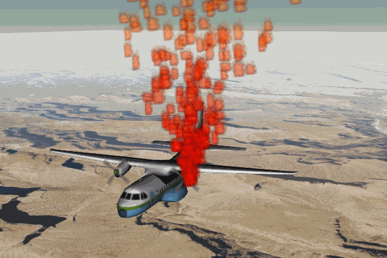

# Cesium Particle Systems

*This tutorial will walk you through Cesium's particle system API and show you how to add more realism and interesting special effects to your Cesium app.*

<p align="center"></p>

## What is a particle system?

Particle systems are a graphical technique that simulates complex physically-based effects.  At their core, particle systems are collections of small images that when viewed together form a more complex "fuzzy" object, such as fire, smoke, clouds, or fireworks. These complex effects are controlled by specifying the behavior of individual particles using properties such as initial position, velocity and lifespan.

Particle system effects are common in movies and video games.  For example, to represent damage to a plane a technical artist could use a particle system to represent an explosion on the plane's engine, then render a different particle system representing a smoke trail from the plane as it crashes.

## Quick Start

Let's get a simple particle system up and running with Cesium.  Open the [Hello World](https://cesiumjs.org/Cesium/Apps/Sandcastle/index.html?src=Hello%20World.html) Sandcastle example.  Add this code to the example:

```
var entity = viewer.entities.add({
    model : {
        uri : '../../SampleData/models/CesiumAir/Cesium_Air.gltf',
    },

    // Create a particle system
    particleSystem : {
        image : '../../SampleData/fire.png',
        rate: 50.0
    },
    position : Cesium.Cartesian3.fromDegrees(-112.110693, 36.0994841, 1000)
});
viewer.trackedEntity = entity;
```

Cesium's particle systems work with the [entity framework](http://cesiumjs.org/tutorials/Visualizing-Spatial-Data/).  This code will load a 3D model of an airplane, and then attach a simple fire particle system to it.  The image property defines the appearance of a single particle.
We're also setting the rate parameter so that the particle system will emit 50 particles every second.


## Emitters

When a particle is born, its initial position and velocity vector are controlled by the ParticleEmitter that is attached to the entity's particleSystem.  If no emitter is specified, a CircleEmitter will be created by default.

Cesium has various ParticleEmitter's that you can use out of the box.

**BoxEmitter**

The BoxEmitter class initializes particles at random positions within a box and directs them outwards from the center of the box.

```
 particleSystem : {
        image : '../../SampleData/fire.png',

        rate: 50.0,

        emitter: new Cesium.BoxEmitter({
            width: 5.0,
            height: 5.0,
            depth: 5.0
        })
    }
```

**CircleEmitter**

The CircleEmitter class initializes particles at random positions within a circle and directs them up.

```
 particleSystem : {
        image : '../../SampleData/fire.png',

        rate: 50.0,

        emitter: new Cesium.CircleEmitter({
            radius: 5.0
        })
    }
```

**ConeEmitter**

The ConeEmitter class initializes particles at the tip of a cone and directs them at random angles out of the cone.

```
 particleSystem : {
        image : '../../SampleData/fire.png',

        rate: 50.0,

        emitter: new Cesium.ConeEmitter({
            radius: 5.0,
            angle: Cesium.Math.toRadians(30.0)
        })
    }
```

**SphereEmitter**

The SphereEmitter class initializes particles at random positions within a sphere and directs them outwards from the center of the sphere.

```
 particleSystem : {
        image : '../../SampleData/fire.png',

        rate: 50.0,

        emitter: new Cesium.SphereEmitter({
            radius: 5.0
        })
    }
```

**Positioning Emitters**

By default, particles emitters are positioned at the center of their parent entity. However, emitters can be positioned arbitrarily within the coordinate space of the entity.  For example, what if we want the fire particles to emit from the propeller of the plane instead of the center?

We can use the emitterModelMatrix property of the ParticleSystem to specify the transform relative to the parent. Change the entity creation code to the following:

```
var entity = viewer.entities.add({
    model : {
        uri : '../../SampleData/models/CesiumAir/Cesium_Air.gltf',
    },

    particleSystem : {
        image : '../../SampleData/fire.png',

        rate: 50.0,

        emitter: new Cesium.ConeEmitter({
            radius: 5.0,
            angle: Cesium.Math.toRadians(30.0)
        }),

        // Position the emitter on the propeller.
        emitterModelMatrix: Cesium.Matrix4.fromTranslation(new Cesium.Cartesian3(2.5, 4.0, 1.0)),
    },

    position : Cesium.Cartesian3.fromDegrees(-112.110693, 36.0994841, 1000)
});
```

## Configuring Particle Systems

Cesium has numerous options for fine-tuning particle behavior.

**Particle emission rate**

The *rate* property controls how many particles are emitted per second.

You can also specify an array of *burst* objects to emit bursts of particles at specified times.  This is a great way to add some variety or explosions to your particle system.

Add this property to your particleSystem.

```
bursts: [
            {time: 5.0, min: 300, max: 500},
            {time: 10.0, min: 50, max: 100},
            {time: 15.0, min: 200, max: 300}
        ]
```

These bursts will emit between min and max particles at the given times.

**Lifetime**

A few properties control the lifetime of a particle system.  By default, particle systems will run forever.

To make a particle system to run for a set duration, set the *lifetime* property to the desired duration in seconds nd set the *loop* property to false.  For example, to run a particle system for 5 seconds use:

```
particleSystem : {
    lifeTime: 5.0,
    loop: false
}

```

Each particle emitted will live for a random number of seconds between the **minimumLife** and **maximumLife** property values.  For example, to make particles live between 5 and 10 seconds, use:
```
particleSystem : {
    minimumLife: 5.0,
    maximumLife: 10.0
}
```


## Styling particles

**Color**

In addition to the base particle texture specified with the *image* property, particles can be styled with a color which can change over the particles lifetime. This helps create more dynamic-looking effects.

For example, the following code will make the fire particles redish when they are born and then transition to a partially transparent yellow as they die:

```
particleSystem : {
    startColor: Cesium.Color.RED.withAlpha(0.7),
    endColor: Cesium.Color.YELLOW.withAlpha(0.3)
}
```

** Size **

The general size of a particle is controlled with the *minimumWidth*, *maximumWidth*, *minimumHeight*, and *maximumHeight* properties.  Each particle will be born with a width in pixels between *minimumWidth* and *maximumWidth* and a height between *minimumHeight* and *maximumHeight*.

This will create particles with size between 30 and 60 pixels:
```
particleSystem : {
    minimumWidth: 30.0,
    maximumWidth: 60.0,
    minimumHeight: 30.0,
    maximumHeight: 60.0
}
```

Like color, the size of a particle can be modulated over its lifetime with the *startScale* and *endScale* properties.  This lets you make particles grow or shink over time.  

This code will make the particles grow to 4x their start size as they age:
```
particleSystem : {
    startScale: 1.0,
    endScale: 4.0
}
```

** Speed **

While the emitter controls the initial position and direction of the particles, speed is controlled by the *minimumSpeed* and *maximumSpeed* settings.  Let's make our particles go between 5 and 10 and meters per second.
```
particleSystem : {
    minimumSpeed: 5.0,
    maximumSpeed: 10.0
}
```

## Forces

To add to the realism of a effect, particle systems can also apply forces like gravity or wind.

Each particle system has an array of force callbacks that modify properties of the particle during the simulation. A force callback is a function that takes in a particle and a simulation time step. Most physically-based effects will modify the velocity vector to change direction or speed.  Here's an example that will make particles react to gravity:
```
var gravityScratch = new Cesium.Cartesian3();
function applyGravity(p, dt) {
     // We need to compute a local up vector for each particle in geocentric space
     Cesium.Cartesian3.fromElements(0, -9.8 * dt, 0, gravityScratch);
     var position = p.position;		
     Cesium.Cartesian3.normalize(position, gravityScratch);		
     Cesium.Cartesian3.multiplyByScalar(gravityScratch, -9.8 * dt, gravityScratch);
    p.velocity = Cesium.Cartesian3.add(p.velocity, gravityScratch, p.velocity);
}
```

This function computes a gravity vector and uses the acceleration of gravity (-9.8 meters per second squared) to alter the velocity of the particle.

Now add the force to the particle systems force array like this:
```
particleSystem: {
	forces: [applyGravity]
}
```

We can't wait to see what cool effects you build with Cesium's new particle system!
